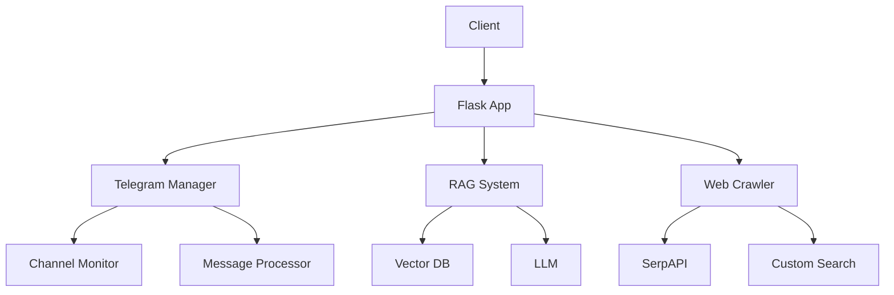

# Retriever Flask API 문서

## 1. 개요
이 프로젝트는 텔레그램 채널 모니터링, 데이터 수집, 분석 및 RAG(Retrieval-Augmented Generation) 기능을 제공하는 Flask 기반 웹 애플리케이션입니다.

## 2. 프로젝트 구조

### 2.1 디렉토리 구조
```
Retriever_Flask/
├── ai/                 # AI 모델 및 관련 유틸리티
├── app.py             # Flask 애플리케이션 메인 파일
├── clustering/        # 데이터 클러스터링 관련 모듈
├── crawl/            # 웹 크롤링 및 데이터 수집 모듈
├── management/       # 프로젝트 관리 및 설정 파일
├── preprocess/       # 데이터 전처리 모듈
├── rag/              # RAG(Retrieval-Augmented Generation) 관련 모듈
├── server/           # 서버 관련 설정 및 유틸리티
├── telegram/         # 텔레그램 API 연동 모듈
├── test/            # 테스트 코드
├── utils.py         # 공통 유틸리티 함수
├── requirements.txt  # 프로젝트 의존성 목록
└── requirements.in   # 핵심 의존성 목록
```

### 2.2 주요 모듈 설명

#### 2.2.1 ai/
- AI 모델 관리 및 추론
- 텍스트 분석 및 분류
- 자연어 처리 유틸리티

#### 2.2.2 crawl/
- 웹 크롤링 엔진
- SerpAPI 연동
- HTML 파싱 및 데이터 추출

#### 2.2.3 telegram/
- 텔레그램 클라이언트 관리
- 채널 모니터링
- 메시지 수집 및 처리

#### 2.2.4 rag/
- RAG 시스템 구현
- 벡터 데이터베이스 연동
- 질의응답 처리

#### 2.2.5 preprocess/
- 데이터 정제
- 텍스트 전처리
- 특징 추출

#### 2.2.6 clustering/
- 데이터 클러스터링
- 유사도 분석
- 패턴 탐지

### 2.3 핵심 파일 설명

#### 2.3.1 app.py
```python
# Flask 애플리케이션의 진입점
# - 라우트 설정
# - 미들웨어 구성
# - 에러 핸들링
```

#### 2.3.2 utils.py
```python
# 공통 유틸리티 함수
# - 데이터 처리
# - 파일 입출력
# - 헬퍼 함수
```

#### 2.3.3 requirements.txt
```
# 프로젝트 의존성
Flask==2.0.1
python-telegram-bot==13.7
transformers==4.11.3
...
```

### 2.4 아키텍처 개요



### 2.5 데이터 흐름

1. 데이터 수집
   - 텔레그램 채널 모니터링
   - 웹 크롤링
   - API 요청

2. 데이터 처리
   - 전처리 및 정제
   - 특징 추출
   - 벡터화

3. 데이터 저장
   - MongoDB
   - Neo4j
   - Weaviate

4. 데이터 활용
   - RAG 기반 질의응답
   - 패턴 분석
   - 인사이트 도출

## 3. 주요 컴포넌트

### 3.1 텔레그램 관리자 (TelegramManager)
텔레그램 채널 모니터링과 관리를 담당하는 핵심 클래스입니다.

```python
class TelegramManager(ConnectMethods, ChannelMethods, TelegramBaseManager, OnBootMethods):
    """텔레그램 채널 관리의 핵심 기능을 제공하는 메인 클래스"""
```

주요 기능:
- 채널 연결 및 모니터링
- 메시지 수집 및 처리
- 채널 정보 관리

### 3.2 RAG 시스템
Watson 기반의 RAG 시스템을 제공합니다.

```python
class Watson(VectorStoreMethods, LangGraphMethods, MongoDBMethods, MemoryMethods):
    """RAG 기반 텔레그램 챗봇의 핵심 Watson 클래스"""
```

주요 기능:
- 벡터 기반 문서 검색
- 대화 컨텍스트 관리
- MongoDB와 Weaviate 연동
- 그래프 기반 메모리 관리

### 3.3 데이터베이스 관리
Neo4j와 MongoDB를 사용한 데이터 저장 및 관리 시스템입니다.

```python
class Neo4j:
    """Neo4j 데이터베이스 관리 클래스"""
```

주요 기능:
- 그래프 데이터 저장
- 관계 쿼리
- 데이터 업데이트

## 4. API 엔드포인트

### 4.1 텔레그램 관련 API

#### 채널 연결
```http
POST /api/telegram/connect
Content-Type: application/json

{
    "channel_id": "string",
    "invite_link": "string"
}
```

#### 채널 모니터링 시작
```http
POST /api/telegram/monitor/start
Content-Type: application/json

{
    "channel_id": "string"
}
```

#### 채널 모니터링 중지
```http
POST /api/telegram/monitor/stop
Content-Type: application/json

{
    "channel_id": "string"
}
```

### 4.2 RAG 관련 API

#### 질의응답
```http
POST /api/rag/query
Content-Type: application/json

{
    "query": "string",
    "context": "string"
}
```

#### 문서 인덱싱
```http
POST /api/rag/index
Content-Type: application/json

{
    "document": "string",
    "metadata": {}
}
```

## 5. 데이터 모델

### 5.1 텔레그램 메시지
```python
class TelegramMessage:
    id: int
    channel_id: int
    content: str
    timestamp: datetime
    media: Optional[Dict]
```

### 5.2 채널 정보
```python
class Channel:
    id: int
    username: str
    title: str
    is_active: bool
    last_updated: datetime
```

## 6. 설정

### 6.1 환경 변수
필요한 환경 변수들:
- `TELEGRAM_API_ID`: 텔레그램 API ID
- `TELEGRAM_API_HASH`: 텔레그램 API Hash
- `PHONE_NUMBER`: 텔레그램 전화번호
- `NEO4J_URI`: Neo4j 데이터베이스 URI
- `NEO4J_USER`: Neo4j 사용자명
- `NEO4J_PASSWORD`: Neo4j 비밀번호
- `MONGODB_URI`: MongoDB 연결 URI

## 7. 설치 및 실행

### 7.1 의존성 설치
```bash
pip install -r requirements.txt
```

### 7.2 환경 변수 설정
`.env.example` 파일을 `.env`로 복사하고 필요한 값들을 설정합니다.

### 7.3 서버 실행
```bash
python app.py
```

## 8. 에러 처리

### 8.1 공통 에러 코드
- 400: 잘못된 요청
- 401: 인증 실패
- 403: 권한 없음
- 404: 리소스를 찾을 수 없음
- 500: 서버 내부 오류

### 8.2 텔레그램 관련 에러
- `InvalidChannelError`: 잘못된 채널 ID 또는 초대 링크
- `ConnectionError`: 텔레그램 연결 실패
- `MonitoringError`: 모니터링 시작/중지 실패

## 9. 보안

### 9.1 인증
- API 키 기반 인증
- 텔레그램 세션 관리

### 9.2 데이터 보안
- 민감 정보 암호화
- 안전한 데이터베이스 연결

## 10. TelegramManager 상세 API

### 10.1 기본 관리자 (TelegramBaseManager)

#### 클래스 개요
```python
class TelegramBaseManager:
    """텔레그램 클라이언트를 백그라운드 스레드에서 생성하고 관리하는 싱글톤 클래스"""
```

#### 주요 메서드

##### `__new__(cls)`
```python
def __new__(cls) -> TelegramBaseManager:
    """싱글톤 객체의 핵심 구현 메서드
    
    Returns:
        TelegramBaseManager: 싱글톤 인스턴스
    """
```

##### `__init__(self)`
```python
def __init__(self):
    """싱글톤 객체의 초기화 메서드
    
    백그라운드 스레드에서는 새로운 이벤트 루프를 생성하고 클라이언트를 초기화하며,
    메인 스레드에서는 기존 값을 유지하거나 None으로 초기화합니다.
    """
```

##### `start_client(self)`
```python
async def start_client(self) -> None:
    """텔레그램 클라이언트를 초기화하고 시작하는 비동기 메서드
    
    Raises:
        RuntimeWarning: 메인 스레드에서 실행될 경우
        ValueError: 이벤트 루프가 없는 경우
        TypeError: 이벤트 루프가 올바른 타입이 아닌 경우
    """
```

##### `get_me(self)`
```python
async def get_me(self) -> int:
    """현재 클라이언트의 사용자 정보를 가져오는 비동기 메서드
    
    Returns:
        int: 현재 클라이언트의 사용자 ID
        
    Raises:
        ValueError: 클라이언트가 초기화되지 않은 경우
    """
```

### 10.2 연결 관리 (ConnectMethods)

#### 클래스 개요
```python
class ConnectMethods:
    """텔레그램 채널 연결 관련 메서드를 제공하는 클래스"""
```

#### 주요 메서드

##### `accept_invitation(self, invite_link: str)`
```python
async def accept_invitation(self, invite_link: str) -> Dict[str, Any]:
    """텔레그램 초대 링크를 통해 채널에 참여하는 메서드
    
    Args:
        invite_link (str): 텔레그램 채널 초대 링크
        
    Returns:
        Dict[str, Any]: 채널 정보를 담은 딕셔너리
        
    Raises:
        ValueError: 초대 링크가 유효하지 않은 경우
        ConnectionError: 채널 연결에 실패한 경우
    """
```

##### `connect_channel(self, channel_id: int = None, invite_link: str = None, username: str = None)`
```python
async def connect_channel(self, channel_id: int = None, invite_link: str = None, username: str = None) -> Dict[str, Any]:
    """채널 ID, 초대 링크 또는 사용자명을 통해 채널에 연결하는 메서드
    
    Args:
        channel_id (int, optional): 채널 ID
        invite_link (str, optional): 초대 링크
        username (str, optional): 채널 사용자명
        
    Returns:
        Dict[str, Any]: 채널 정보를 담은 딕셔너리
        
    Raises:
        ValueError: 유효한 연결 정보가 제공되지 않은 경우
        ConnectionError: 채널 연결에 실패한 경우
    """
```

### 10.3 채널 관리 (ChannelMethods)

#### 클래스 개요
```python
class ChannelMethods:
    """텔레그램 채널 관리 관련 메서드를 제공하는 클래스"""
```

#### 주요 메서드

##### `get_channel_info(self, channel_id: int)`
```python
async def get_channel_info(self, channel_id: int) -> Dict[str, Any]:
    """채널의 상세 정보를 조회하는 메서드
    
    Args:
        channel_id (int): 채널 ID
        
    Returns:
        Dict[str, Any]: 채널 정보를 담은 딕셔너리
        
    Raises:
        ValueError: 채널을 찾을 수 없는 경우
    """
```

##### `get_channel_messages(self, channel_id: int, limit: int = 100)`
```python
async def get_channel_messages(self, channel_id: int, limit: int = 100) -> List[Dict[str, Any]]:
    """채널의 메시지 목록을 조회하는 메서드
    
    Args:
        channel_id (int): 채널 ID
        limit (int, optional): 조회할 메시지 수. 기본값 100
        
    Returns:
        List[Dict[str, Any]]: 메시지 정보 목록
        
    Raises:
        ValueError: 채널을 찾을 수 없는 경우
    """
```

### 10.4 모니터링 관리 (MonitorMethods)

#### 클래스 개요
```python
class MonitorMethods:
    """텔레그램 채널 모니터링 관련 메서드를 제공하는 클래스"""
```

#### 주요 메서드

##### `start_monitoring(self, channel_id: int)`
```python
async def start_monitoring(self, channel_id: int) -> None:
    """채널 모니터링을 시작하는 메서드
    
    Args:
        channel_id (int): 모니터링할 채널 ID
        
    Raises:
        ValueError: 채널을 찾을 수 없는 경우
        RuntimeError: 모니터링 시작에 실패한 경우
    """
```

##### `stop_monitoring(self, channel_id: int)`
```python
async def stop_monitoring(self, channel_id: int) -> None:
    """채널 모니터링을 중지하는 메서드
    
    Args:
        channel_id (int): 모니터링을 중지할 채널 ID
        
    Raises:
        ValueError: 채널을 찾을 수 없는 경우
        RuntimeError: 모니터링 중지에 실패한 경우
    """
```

##### `monitor_channel(self, channel_id: int)`
```python
async def monitor_channel(self, channel_id: int) -> None:
    """채널의 새 메시지를 모니터링하는 메서드
    
    Args:
        channel_id (int): 모니터링할 채널 ID
        
    Raises:
        ValueError: 채널을 찾을 수 없는 경우
        ConnectionError: 모니터링 연결에 실패한 경우
    """
```

### 10.5 부팅 관리 (OnBootMethods)

#### 클래스 개요
```python
class OnBootMethods:
    """텔레그램 매니저가 시작될 때 실행되는 메서드를 제공하는 클래스"""
```

#### 주요 메서드

##### `__init__(self)`
```python
def __init__(self):
    """초기화 메서드. 부팅 시 모니터링을 재개합니다."""
```

##### `resume_monitoring(self)`
```python
def resume_monitoring(self):
    """데이터베이스에 저장된 모든 활성 채널에 대한 모니터링을 재개합니다."""
```

### 10.6 유틸리티 함수

#### 메시지 처리
```python
def extract_sender_info(sender) -> Dict[str, Any]:
    """텔레그램 메시지의 발신자 정보를 추출하는 함수
    
    Args:
        sender: Telethon User/Channel 객체
        
    Returns:
        Dict[str, Any]: 발신자 정보를 담은 딕셔너리
    """
```

#### URL 생성
```python
def get_message_url_from_event(event) -> Optional[str]:
    """이벤트 객체로부터 메시지 URL을 생성하는 함수
    
    Args:
        event: Telethon 이벤트 객체
        
    Returns:
        Optional[str]: 메시지 URL 또는 None
    """
```

#### 미디어 처리
```python
async def download_media(message, client) -> Tuple[Optional[bytes], Optional[str]]:
    """텔레그램 메시지의 미디어를 다운로드하는 함수
    
    Args:
        message: Telethon 메시지 객체
        client: Telethon 클라이언트
        
    Returns:
        Tuple[Optional[bytes], Optional[str]]: (미디어 데이터, MIME 타입) 또는 (None, None)
    """
```

## 11. RAG 시스템 상세 API

### 11.1 Watson 클래스

#### 클래스 개요
```python
class Watson(VectorStoreMethods, LangGraphMethods, MongoDBMethods, MemoryMethods):
    """RAG 기반 텔레그램 챗봇의 핵심 Watson 클래스
    
    이 클래스는 텔레그램 채널의 메시지를 벡터화하여 저장하고,
    사용자의 질의에 대해 관련된 컨텍스트를 검색하여 응답을 생성합니다.
    """
```

#### 주요 메서드

##### `__new__(cls, *, bot_id: Optional[int] = None, channel_ids: Optional[list[int]] = None, scope: Optional[str] = None, _from_db: bool = False)`
```python
def __new__(cls, *, bot_id: Optional[int] = None, channel_ids: Optional[list[int]] = None, scope: Optional[str] = None, _from_db: bool = False):
    """Watson 인스턴스를 생성하거나, 이미 존재하면 반환합니다.
    
    Args:
        bot_id (Optional[int]): Watson 인스턴스의 ID
        channel_ids (Optional[list[int]]): Watson이 참조할 채널 ID 목록
        scope (Optional[str]): Watson의 범위
        _from_db (bool): DB에서 직접 로드 여부
        
    Returns:
        Watson: Watson 인스턴스
        
    Raises:
        ValueError: bot_id 또는 (channel_ids와 scope)가 제공되지 않은 경우
    """
```

##### `__init__(self, *, bot_id: Optional[int] = None, channel_ids: Optional[list[int]] = None, scope: Optional[str] = None, _from_db: bool = False)`
```python
def __init__(self, *, bot_id: Optional[int] = None, channel_ids: Optional[list[int]] = None, scope: Optional[str] = None, _from_db: bool = False):
    """Watson 인스턴스를 초기화합니다.
    
    Args:
        bot_id (Optional[int]): Watson 인스턴스의 ID
        channel_ids (Optional[list[int]]): Watson이 참조할 채널 ID 목록
        scope (Optional[str]): Watson의 범위
        _from_db (bool): DB에서 직접 로드 여부
        
    Raises:
        KeyError: DB에 존재하지 않는 bot_id인 경우
        ValueError: bot_id 또는 (channel_ids와 scope)가 제공되지 않은 경우
    """
```

### 11.2 VectorStoreMethods 클래스

#### 클래스 개요
```python
class VectorStoreMethods:
    """Weaviate 벡터스토어 연동 및 동기화 관련 메서드를 제공하는 클래스"""
```

#### 주요 메서드

##### `get_vectorstore(weaviate_client: Optional[WeaviateClient] = None)`
```python
@staticmethod
def get_vectorstore(weaviate_client: Optional[WeaviateClient] = None):
    """Weaviate 벡터스토어 인스턴스를 반환합니다.
    
    Args:
        weaviate_client (Optional[WeaviateClient]): 외부에서 전달받은 클라이언트
        
    Returns:
        WeaviateVectorStore: 벡터스토어 인스턴스
    """
```

##### `register_schema(weaviate_client: WeaviateClient)`
```python
@staticmethod
def register_schema(weaviate_client: WeaviateClient) -> None:
    """Weaviate에 TelegramMessages 스키마를 등록합니다.
    
    Args:
        weaviate_client (WeaviateClient): Weaviate 클라이언트
    """
```

##### `update_vectorstore(self: 'Watson')`
```python
def update_vectorstore(self: 'Watson'):
    """MongoDB와 Weaviate 벡터스토어를 동기화합니다.
    
    MongoDB의 채팅 데이터를 Weaviate 벡터스토어에 업로드하고,
    중복된 데이터를 정리합니다.
    """
```

##### `build_loader(ids: list[ObjectId])`
```python
@staticmethod
def build_loader(ids: list[ObjectId]) -> MongodbLoader:
    """MongoDB에서 지정된 ID의 채팅 데이터를 로드하는 커스텀 로더를 반환합니다.
    
    Args:
        ids (list[ObjectId]): 로드할 채팅의 ObjectId 목록
        
    Returns:
        MappedMongodbLoader: 커스텀 MongoDB 로더
    """
```

### 11.3 MappedMongodbLoader 클래스

#### 클래스 개요
```python
class MappedMongodbLoader(MongodbLoader):
    """MongoDB에서 데이터를 로드할 때 메타데이터 필드명을 매핑하여 반환하는 커스텀 로더 클래스"""
```

#### 주요 메서드

##### `__init__(self, connection_string: str, db_name: str, collection_name: str, *, filter_criteria: Optional[Dict] = None, field_names: Optional[Sequence[str]] = None, metadata_names: Optional[Sequence[str]] = None, metadata_mapping: Optional[Dict[str, str]] = None, include_db_collection_in_metadata: bool = True)`
```python
def __init__(self, connection_string: str, db_name: str, collection_name: str, *, filter_criteria: Optional[Dict] = None, field_names: Optional[Sequence[str]] = None, metadata_names: Optional[Sequence[str]] = None, metadata_mapping: Optional[Dict[str, str]] = None, include_db_collection_in_metadata: bool = True):
    """커스텀 MongoDB 로더를 초기화합니다.
    
    Args:
        connection_string (str): MongoDB 연결 문자열
        db_name (str): 데이터베이스 이름
        collection_name (str): 컬렉션 이름
        filter_criteria (Optional[Dict]): 필터 조건
        field_names (Optional[Sequence[str]]): 로드할 필드명
        metadata_names (Optional[Sequence[str]]): 메타데이터 필드명
        metadata_mapping (Optional[Dict[str, str]]): 메타데이터 키 매핑
        include_db_collection_in_metadata (bool): DB/컬렉션 메타데이터 포함 여부
    """
```

##### `aload(self)`
```python
async def aload(self) -> List[Document]:
    """비동기적으로 데이터를 Document 객체로 로드합니다.
    
    Returns:
        List[Document]: 로드된 Document 객체 리스트
    """
```

### 11.4 LangGraphMethods 클래스

#### 클래스 개요
```python
class LangGraphMethods:
    """LangGraph 기반 워크플로우 및 질의 실행 메서드를 제공하는 클래스"""
```

#### 주요 메서드

##### `build_graph(self: 'Watson')`
```python
def build_graph(self: 'Watson') -> Optional[CompiledStateGraph]:
    """LangGraph 워크플로우를 빌드합니다.
    
    워크플로우는 다음과 같은 노드들로 구성됩니다:
    1. ask_question: 사용자 질문을 상태에 저장
    2. classify: 질문을 데이터 기반/일반 질문으로 분류
    3. search: Weaviate에서 관련 문서 검색
    4. generate: 검색 결과를 바탕으로 답변 생성
    
    Returns:
        Optional[CompiledStateGraph]: 빌드된 그래프 객체. chats가 없으면 None 반환
    """
```

##### `_update_graph(self: 'Watson')`
```python
def _update_graph(self: 'Watson'):
    """그래프를 새로 빌드하여 self.graph에 할당합니다."""
```

##### `ask(self: 'Watson', question: str)`
```python
def ask(self: 'Watson', question: str):
    """질문을 입력받아 LangGraph를 통해 답변을 생성합니다.
    
    Args:
        question (str): 사용자 질문
        
    Returns:
        str: 생성된 답변 또는 오류 메시지
    """
```

### 11.5 LangGraphNodes 클래스

#### 클래스 개요
```python
class LangGraphNodes:
    """LangGraph 기반 RAG 워크플로우의 각 노드(질문, 분류, 검색, 생성 등)를 정의하는 클래스"""
```

#### 주요 메서드

##### `ask_question(state: GraphState)`
```python
@staticmethod
def ask_question(state: GraphState) -> GraphState:
    """질문 노드: 사용자의 질문을 State에 저장합니다.
    
    Args:
        state (GraphState): 현재 상태
        
    Returns:
        GraphState: 질문이 반영된 새로운 상태
    """
```

##### `classify(state: GraphState)`
```python
@staticmethod
def classify(state: GraphState) -> Literal["data", "others"]:
    """사용자의 초기 질문을 바탕으로 데이터 기반 질문인지, 이전 답변 기반 질문인지를 AI가 판단합니다.
    
    Returns:
        Literal["data", "others"]: 
            - "data": 데이터 기반 질문
            - "others": 이전 답변 기반 질문
    """
```

##### `execute_search(state: GraphState, channel_ids: list[int], index_name=weaviate_index_name)`
```python
@staticmethod
def execute_search(state: GraphState, channel_ids: list[int], index_name=weaviate_index_name) -> GraphState:
    """Weaviate에서 텔레그램 메시지를 검색하고, 결과를 state에 반영합니다.
    
    Args:
        state (GraphState): 현재 상태
        channel_ids (list[int]): 검색할 채널 ID 목록
        index_name (str): Weaviate 인덱스명
        
    Returns:
        GraphState: 검색 결과가 반영된 새로운 상태
    """
```

##### `generate(state: GraphState, channel_info: dict)`
```python
@staticmethod
def generate(state: GraphState, channel_info: dict) -> GraphState:
    """검색 결과를 바탕으로 최종 답변을 생성합니다.
    
    Args:
        state (GraphState): 현재 상태
        channel_info (dict): 채널 정보
        
    Returns:
        GraphState: 생성된 답변이 반영된 새로운 상태
    """
```

### 11.6 유틸리티 함수

#### 필터 파싱
```python
def parse_filter_node(node: dict):
    """Weaviate 필터 노드를 재귀적으로 파싱하여 Filter 객체로 변환합니다.
    
    Args:
        node (dict): 필터 조건 노드
        
    Returns:
        Filter: 변환된 Weaviate Filter 객체
        
    Raises:
        ValueError: 지원하지 않는 연산자나 잘못된 필터 구조인 경우
    """
```

#### 정렬 파싱
```python
def parse_sort_list(sort_json: list[dict]):
    """정렬 조건 리스트를 Sort 객체로 변환합니다.
    
    Args:
        sort_json (list[dict]): 정렬 조건 리스트
            각 요소는 {"field": str, "direction": "asc"|"desc"} 형식
            
    Returns:
        Sort: 체이닝된 Sort 객체
    """
```

#### 상태 업데이트
```python
def update_state(state: GraphState, node_name: str, **updates) -> GraphState:
    """Graph의 State를 업데이트합니다.
    
    Args:
        state (GraphState): 기존 상태 객체
        node_name (str): 노드 이름
        **updates: 추가로 반영할 상태 값들
        
    Returns:
        GraphState: 업데이트된 상태 객체
    """
```

### 11.7 MemoryMethods 클래스

#### 클래스 개요
```python
class MemoryMethods:
    """챗봇의 메모리(체크포인트) 관리 메서드를 제공하는 클래스"""
```

#### 주요 메서드

##### `clear_memory(self: 'Watson')`
```python
def clear_memory(self: 'Watson') -> None:
    """MongoDB에 저장된 챗봇의 기억을 제거하는 메서드.
    
    Returns:
        None
    """
```

#### 체크포인터
```python
checkpointer = MongoDBSaver(
    mongo_client,
    db_name=db_name,
    checkpoint_collection_name="chat_bot_checkpoints",
    writes_collection_name="chat_bot_checkpoint_writes",
)
```

### 11.8 MongoDBMethods 클래스

#### 클래스 개요
```python
class MongoDBMethods:
    """Watson 챗봇의 MongoDB 관련 메서드를 제공하는 클래스"""
```

#### 주요 메서드

##### `update_db(self: 'Watson')`
```python
def update_db(self: 'Watson'):
    """현재 챗봇의 정보를 MongoDB에 갱신하거나 신규 생성합니다.
    
    업데이트되는 정보:
    - updatedAt: 마지막 업데이트 일시
    - channels: 참조 중인 채널 목록
    - chats: 참조 중인 채팅 목록
    - scope: 챗봇의 범위
    
    Returns:
        None
    """
```

##### `get_channel_info(self: 'Watson')`
```python
def get_channel_info(self: 'Watson') -> dict[str, dict[str, Any]]:
    """챗봇이 참조하는 채널들의 정보를 반환합니다.
    
    Returns:
        dict: 채널 정보 딕셔너리
            각 채널의 정보는 다음을 포함:
            - channel id: 채널 ID
            - channel title: 채널 제목
            - this channel is created at: 채널 생성 일시
            - we discovered this channel at: 채널 발견 일시
    """
```

### 11.9 상수 및 설정

#### 데이터베이스 컬렉션
```python
# 챗봇 관련 컬렉션
chatbot_collection = Database.Collection.CHATBOT  # 챗봇 메타데이터
chat_collection = Database.Collection.Channel.DATA  # 채널 대화 데이터
channel_collection = Database.Collection.Channel.INFO  # 채널 정보
checkpoints_collection = Database.Collection.CHATBOT_CHECKPOINTS  # 챗봇 체크포인트
checkpoint_writes_collection = Database.Collection.CHATBOT_CHECKPOINT_WRITES  # 챗봇 체크포인트 기록
```

#### Weaviate 설정
```python
# Weaviate 관련 상수
dimension_size = 1536  # 임베딩 차원 크기
weaviate_index_name = "TelegramMessages"  # Weaviate 인덱스 이름

# API 키 헤더
weaviate_headers = {
    "X-OpenAI-Api-Key": os.getenv("OPENAI_API_KEY"),
    "X-HuggingFace-Api-Key": os.getenv("HUGGINGFACE_API_KEY"),
    "X-Cohere-Api-Key": os.getenv("COHERE_APIKEY"),
}
```

### 11.10 Weaviate 유틸리티

#### Weaviate 연결
```python
def connect_weaviate() -> WeaviateClient:
    """로컬 Weaviate 인스턴스에 연결합니다.
    
    Returns:
        WeaviateClient: 연결된 Weaviate 클라이언트
    """
```

#### WeaviateClientContext 클래스
```python
class WeaviateClientContext:
    """with 문에서 Weaviate 클라이언트 연결을 관리하는 컨텍스트 매니저 클래스"""
    
    def __enter__(self):
        """컨텍스트 진입 시 Weaviate 클라이언트 연결을 반환합니다."""
        
    def __exit__(self, exc_type, exc_val, exc_tb):
        """컨텍스트 종료 시 클라이언트 연결을 닫습니다."""
```

### 11.11 Watson 클래스 상세 설명

#### 클래스 구조
```python
class Watson(VectorStoreMethods, LangGraphMethods, MongoDBMethods, MemoryMethods):
    """RAG 기반 텔레그램 챗봇의 핵심 Watson 클래스
    
    이 클래스는 다음과 같은 믹스인 클래스들의 기능을 조합합니다:
    - VectorStoreMethods: Weaviate 벡터스토어 연동
    - LangGraphMethods: LangGraph 기반 워크플로우
    - MongoDBMethods: MongoDB 데이터 관리
    - MemoryMethods: 체크포인트 기반 메모리 관리
    """
```

#### 주요 속성
```python
class Watson:
    GLOBAL = "global"  # 전역 범위
    MULTI = "multi"    # 다중 채널 범위
    LOCAL = "local"    # 단일 채널 범위
    
    embedding = OpenAIEmbeddings()  # OpenAI 임베딩 모델
    vectorstore = VectorStoreMethods.get_vectorstore()  # Weaviate 벡터스토어
```

#### 인스턴스 속성
```python
class Watson:
    id: int  # 챗봇 ID
    channels: list[int]  # 참조 중인 채널 ID 목록
    chats: list[int]  # 참조 중인 채팅 ID 목록
    scope: str  # 챗봇의 범위 (GLOBAL/MULTI/LOCAL)
    graph: Optional[CompiledStateGraph]  # LangGraph 워크플로우
```

#### 사용 예시
```python
# 새로운 Watson 인스턴스 생성
watson = Watson(
    channel_ids=[123456789],  # 참조할 채널 ID
    scope=Watson.LOCAL  # 단일 채널 범위
)

# 질문하기
answer = watson.ask("채널에서 가장 인기 있는 메시지는 무엇인가요?")

# 메모리 초기화
watson.clear_memory()
```

## 12. AI 모듈

### 12.1 데이터 모델 (datamodel.py)

#### 12.1.1 Classification
```python
class Classification(BaseModel):
    question_classification: Literal["data", "others"]
```
- 사용자 질문의 분류 결과를 나타내는 모델
- `data`: 텔레그램 채널과 채팅 데이터 기반 질문
- `others`: 일반적인 질문

#### 12.1.2 Query
```python
class Query(BaseModel):
    collection: Literal["channel_info", "channel_data"]
    pipeline: Json[list[dict[str, Any]]]
```
- 데이터베이스 요청을 위한 JSON 모델
- `collection`: 쿼리할 컬렉션 지정
- `pipeline`: MongoDB 집계 파이프라인

#### 12.1.3 GraphState
```python
class GraphState(TypedDict):
    messages: Annotated[Sequence[BaseMessage], add_messages]
    question: Annotated[str, "Question"]
    debug: Annotated[bool, "Debug"]
    type: Annotated[Literal["data", "others"], "Type"]
```
- 에이전트 상태를 정의하는 타입 딕셔너리
- 메시지 시퀀스 관리 및 추가 동작 정의

#### 12.1.4 SearchCondition
```python
class SearchCondition(BaseModel):
    query: Optional[str]
    channelId: Optional[int]
    after: Optional[str]
    before: Optional[str]
    keyword: Optional[str]
```
- Weaviate 벡터 검색 조건을 정의하는 모델
- 시맨틱 검색, 채널 ID, 시간 범위, 키워드 필터링 지원

#### 12.1.5 Catalog
```python
class Catalog(BaseModel):
    chatIds: list[int]
    catalog: str
```
- 마약 가격 정보를 포함하는 채팅 메시지 ID 목록과 요약 정보

### 12.2 지시사항 (indications.py)

#### 12.2.1 Indications.Generate
- 채팅 기반 QA를 위한 프롬프트 템플릿
- 마약 관련 은어 예시 포함
- 채널 정보와 컨텍스트 기반 응답 생성

#### 12.2.2 Indications.Classify
- 사용자 질문을 'data' 또는 'others'로 분류하는 프롬프트
- 텔레그램 채널/메시지 데이터 관련 질문 구분

#### 12.2.3 Indications.Interpret
- Weaviate 쿼리 해석을 위한 프롬프트
- 시맨틱 검색, 필터, 정렬 조건 추출
- 가격 관련 쿼리 처리 규칙

#### 12.2.4 Indications.Extract
- 마약 가격 정보 추출을 위한 프롬프트
- 가격, 수량, 단위 정보 구조화
- 은어/단위 변환 규칙 포함

### 12.3 텔레그램 분석 (telegram.py)

#### 12.3.1 BinaryClassification
```python
class BinaryClassification(BaseModel):
    binary_classification: bool
```
- 텔레그램 채널의 마약 판매 여부를 판단하는 모델

#### 12.3.2 check_telegram_by_openai
```python
def check_telegram_by_openai(message: str) -> bool
```
- OpenAI를 사용하여 텔레그램 메시지의 마약 판매 여부 확인
- 마약 관련 은어 감지 및 분석

#### 12.3.3 Report
```python
class Report(BaseModel):
    report_type: Literal[
        "상품 소개", "가격", "이벤트 안내", "입고 소식",
        "직원 구인", "개인정보", "판매 지역", "구매 방법",
        "새로운 은어"
    ]
    report_content: str
    report_description: str
```
- 텔레그램 메시지에서 추출한 정보 보고서 모델
- 다양한 보고서 유형과 설명 포함

#### 12.3.4 Intelligence
```python
class Intelligence(BaseModel):
    reports: list[Report]
```
- 추출된 보고서 목록을 포함하는 정보 모델

#### 12.3.5 get_reports_by_openai
```python
def get_reports_by_openai(message: str) -> list[Report]
```
- OpenAI를 사용하여 텔레그램 메시지에서 정보 추출
- 다양한 유형의 보고서 생성

## 13. 크롤링 API

### 13.1 웹 크롤링 엔드포인트

#### 13.1.1 일반 웹 검색 API
```http
POST /crawl/links
Content-Type: application/json

{
    "queries": ["검색어1", "검색어2"],
    "max_results": 10
}
```

주요 기능:
- Google Custom Search API를 사용한 웹 검색
- 일반 URL과 텔레그램 채널 링크 분리 추출
- 중복 제거 및 결과 병합

#### 13.1.2 SerpAPI 검색
```http
GET /crawl/links/serpapi?q=검색어1&q=검색어2&max_results=10
```

주요 기능:
- SerpAPI를 통한 Google 검색
- 한국어/한국 지역 기반 검색 결과
- 페이지네이션을 통한 결과 수집

#### 13.1.3 HTML 내용 가져오기
```http
POST /crawl/html
Content-Type: application/json

{
    "link": "https://example.com"
}
```

주요 기능:
- 지정된 URL의 HTML 내용 추출
- 사용자 에이전트 헤더 사용
- 오류 처리 및 로깅

### 13.2 크롤러 모듈 (crawler.py)

#### 13.2.1 Google 검색
```python
def google_search(query: str, num_results: int = 10) -> dict[str:list, str:list]:
```

주요 기능:
- Google Custom Search API 사용
- 검색 결과에서 URL 추출
- 텔레그램 채널 링크 자동 분류
- 페이지네이션 처리 (10개 단위)

매개변수:
- `query`: 검색할 쿼리 문자열
- `num_results`: 가져올 검색 결과 수 (기본값: 10)

반환값:
- `dict`: 일반 URL 목록과 텔레그램 채널 목록을 포함하는 딕셔너리

#### 13.2.2 통합 검색
```python
def search_links(queries: list[str], max_results: int) -> dict:
```

주요 기능:
- 여러 검색어에 대한 통합 검색
- 결과 중복 제거
- 로깅 및 진행 상황 추적

매개변수:
- `queries`: 검색할 쿼리 문자열 목록
- `max_results`: 각 쿼리당 최대 검색 결과 수

반환값:
```python
{
    'google': list[str],     # 일반 URL 목록
    'telegrams': list[str]   # 텔레그램 채널 목록
}
```

### 13.3 SerpAPI 모듈 (serpapi.py)

#### 13.3.1 단일 검색
```python
def serp(q: str, max_result: int = 10) -> tuple[list[dict[str, str]], list[str]]:
```

주요 기능:
- SerpAPI를 통한 Google 검색
- 한국어/한국 지역 기반 검색
- 성인 콘텐츠 필터링 해제
- 자동 교정 검색 제외

매개변수:
- `q`: 검색어 쿼리 문자열
- `max_result`: 최대 검색 결과 수

반환값:
```python
(
    [                           # 일반 웹 검색 결과
        {
            "title": str,       # 페이지 제목
            "link": str,        # URL
            "source": str       # 도메인 이름
        },
        ...
    ],
    [str, ...]                 # 텔레그램 채널 이름 목록
)
```

#### 13.3.2 다중 검색
```python
def search_links_by_serpapi(queries: list[str], max_results: int = 10) -> dict:
```

주요 기능:
- 여러 검색어에 대한 병렬 검색
- 결과 인터리빙 및 중복 제거
- 상세한 로깅

매개변수:
- `queries`: 검색어 문자열 목록
- `max_results`: 각 쿼리당 최대 검색 결과 수

반환값:
```python
{
    'google': [               # 일반 웹 검색 결과
        {
            "title": str,     # 페이지 제목
            "link": str,      # URL
            "source": str     # 도메인 이름
        },
        ...
    ],
    'telegrams': [str, ...]  # 텔레그램 채널 이름 목록
}
```

### 13.4 유틸리티 함수

#### 13.4.1 HTML 추출
```python
def get_html_from_url(url: str) -> str:
```

주요 기능:
- URL에서 HTML 내용 가져오기
- 사용자 에이전트 헤더 사용
- 오류 처리 및 로깅

매개변수:
- `url`: HTML을 가져올 URL

반환값:
- `str`: HTML 내용 (실패 시 빈 문자열)

#### 13.4.2 HTML 저장
```python
def save_html(html: str, folder_path: str, file_name: str) -> None:
```

주요 기능:
- HTML 내용을 파일로 저장
- 저장 폴더 자동 생성
- 파일 경로 로깅

매개변수:
- `html`: 저장할 HTML 내용
- `folder_path`: 저장할 폴더 경로
- `file_name`: 저장할 파일 이름
